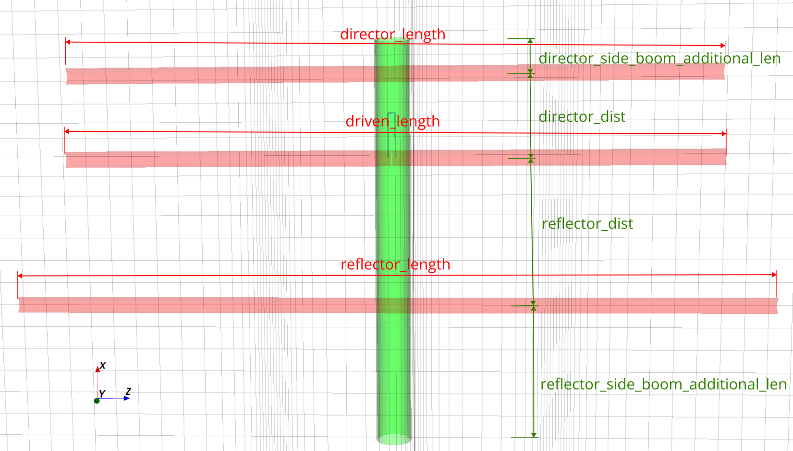

# Antena Yagi-Uda para a faixa dos 2 metros

Nesta prática, vamos projetar e simular uma antena Yagi-Uda para a faixa de 2 metros do serviço radioamador.

Em particular, nosso objetivo é otimizar a antena para 145.825 MHz, a frequência utilizada para [APRS na ISS](https://www.aprs.org/iss-faq.html).

Este repositório contém os códigos base necessários para simular a antena com o [OpenEMS](https://openems.io), mas se você preferir, pode usar outros simuladores, como alguma variante do [NEC](https://en.wikipedia.org/wiki/Numerical_Electromagnetics_Code) ou o [FEKO](https://altair.com/feko).

## Dependências

No Arch Linux, utilize os pacotes a seguir obtidos do [AUR](https://aur.archlinux.org) ou precompilados do [Chaotic AUR](https://aur.chaotic.cx):


```bash
sudo pacman -S openmpi openems-git csxcad-git qcsxcad-git appcsxcad-git python-openems-git python-csxcad-git python-matplotlib
```

Se você usa outra distribuição, prefixe todos os comandos descritos neste documento com `./run-docker` para executá-los dentro de um container.

## Explicação dos parâmetros

### Configurações de simulação

Todos os códigos de simulação deste repositório contém os seguintes três parâmetros:

* `enable_appcsxcad`: Abre uma janela com o modelo 3D da antena antes de iniciar a simulação. Mantenha desativado caso você tenha problemas com uso de interface gráfica no Docker. Mesmo quando o modelo 3D não é mostrado na tela, ele é gravado em XML no diretório [models](models). 

* `enable_show_plots`: Abre em janelas os gráficos gerados pelo script. Mantenha desativado caso você tenha problemas com uso de interface gráfica no Docker. Mesmo quando os gráficos não são mostrados na tela, eles são gravados em formato SVG no diretório [results](results). 

* `enable_nf2ff`: Ativa a simulação de campo distante. Recomendamos ativar somente quando você estiver fazendo estudos de direcionalidade, pois esta opção deixa a simulação mais lenta.

## Parâmetros de geometria da antena

O arquivo [yagi_trena.py](yagi_trena.py) contém o código necessário para simular uma antena Yagi-Uda.

Os parâmetros geométricos são ilustrados nas figuras a seguir.




Caso `hairpin_enable` seja ativado, o script insere um [hairpin](https://smarc.org.au/wp-content/uploads/2021/11/Hairpin-Matching-VK2DEQ.pdf) com os parâmetros geométricos a seguir.


Caso necessário, sinta-se livre para editar o script e modificar o código que desenha o modelo, mas atente-se para a saída do OpenEMS. Se a mensagem `Warning: Unused primitive (type: XXX) detected in property: YYY!` aparecer, significa que você precisa editar também o *mesh* para incluir pelo menos uma linha passando pela figura geométrica que você adicionou ao modelo.


## Roteiro

Como as simulações com o OpenEMS exigem muito processamento e são demoradas (da ordem de 10 minutos em um laptop típico), **esta prática não tem correção automática**.

Clone este repositório, faça as modificações necessárias em [yagi_trena.py](yagi_trena.py), se precisar adicione novos arquivos, e **edite este README.md** respondendo às perguntas abaixo.

Inclua screenshots e gráficos gerados pelo simulador para ilustrar e justificar suas respostas.

### Ressonância

* Você consegue ajustar os parâmetros geométricos da sua antena para que a ressonância ocorra em 145.825 MHz?

Sim, foi possível alterar os parâmetros geométricos a fim de atingir 145.825 MHz. Após algumas tentativas, alterando parâmetros, como `director_length`, `director_dist`,`driven_dist`, `reflector_length`, `reflector_dist` e `driven_wire_radius`, a ressonância se encontrou em 145.8 MHz


* Qual a banda da sua antena? Como ela se compara com a banda de uma antena dipolo ([dipole.py](dipole.py) ou [dipole_trena.py](dipole_trena.py))? O que seria necessário para que a banda da sua antena fosse mais estreita em torno de 145.825 MHz?

- Banda da antena: A banda de uma antena pode ser encontrada analisando as frequências em que S11 < -10 dB. Porém, estando o hair_pin desabilitado, não foi possível obter tal valor para S11. O mínimo obtido foi S11 < -4 dB. Nesse caso o valor de banda foi igual a 21.5 MHz


- Comparação: A banda de uma antena dipolo, no caso  em dipole.py, é igual a 27.1 MHz em S11 < -10 dB, já maior que a antena Yagi, sem a realização de ajustes.

- Estreitamento de banda: O aumento de refletore e/ou diretores auxiliaria na redução da banda, aumentando a seletividade em frequência. A redução dos espaçamentos também ajudaria na redução de banda, aumentando o ganho direcional.

### Impedância

* Você consegue casar a impedância da sua antena com a impedância do transceptor de rádio (50 ohms, puramente reais), mantendo-a em ressonância na frequência desejada? A abordagem sugerida é ativar `hairpin_enable` e usar um [hairpin](https://smarc.org.au/wp-content/uploads/2021/11/Hairpin-Matching-VK2DEQ.pdf) para fazer o casamento.

Sim, é possível realizar o casamento

### Direcionalidade

* Você consegue comprovar que a antena Yagi-Uda é direcional?

   Dica: Compare com a saída de algum dos simuladores de antena dipolo ([dipole.py](dipole.py) ou [dipole_trena.py](dipole_trena.py)).

* Você consegue comprovar que a sua Yagi-Uda irradia mais na direção do elemento *director* que na direção do elemento *reflector*, ou seja, que a sua antena não está invertida?

* Você consegue melhorar a direcionalidade (e consequentemente, o ganho) da sua Yagi-Uda modificando os parâmetros geométricos (mantendo-a em ressonância e com a impedância casada em 50 ohms na frequência desejada)?
